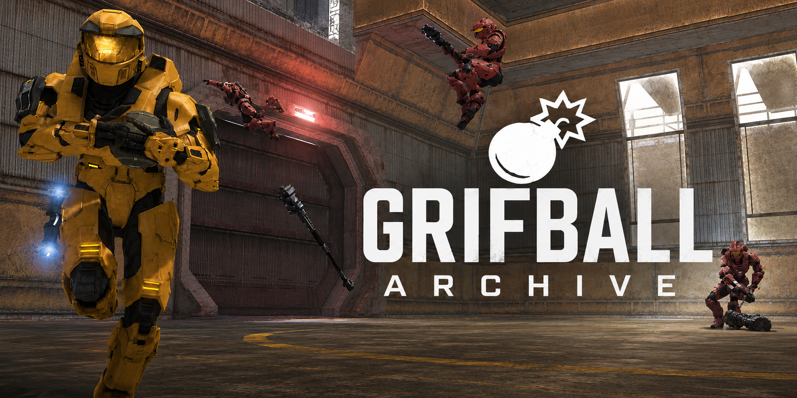

# Welcome

The **Grifball Archive** is a place for **all Grifball archives** — articles, stats, sheets, images, and videos. This site is for **browsing and preservation**; anyone can contribute and download the whole archive from GitHub.

## Start reading on this site

- **[Historical Record](history/overview.md)** — chronology and context.
- **[Articles](articles/overview.md)** — long-form write-ups.
- **[Stats and Sheets](statistics/overview.md)** — spreadsheets, numbers, signups, season details.
- **[Video Library](video/overview.md)** — VOD catalogs, videos, clips.
- **[Webpages](webpages/overview.md)** — saved page content, screenshots, and other web snapshots.
- **[Image Library](image-library/overview.md)** — catalogs of still images and where to open them.
- **[Misc / Uncategorized](misc/overview.md)** — when you are not sure which section fits yet; maintainers can sort it later.

## Contributing
ANYONE CAN CONTRIBUTE with a free github account.
To add or fix content, use **[Submitting materials](contributing/submitting-materials.md)** (pull requests). The pencil **Edit** control in the header opens the source file on GitHub when you are signed in.
